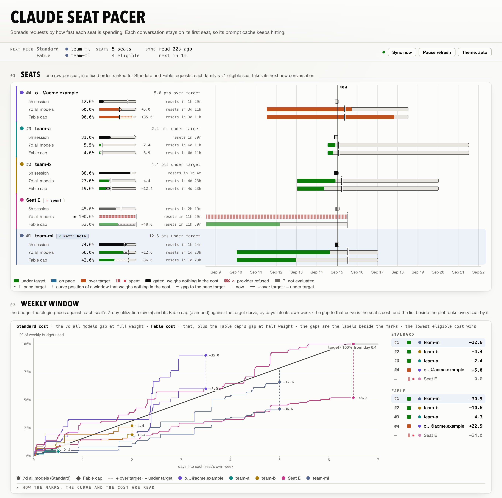

# Claude Seat Pacer

Uses up each Claude seat's weekly quota before it resets, and keeps every conversation on one seat so its prompt cache keeps working.

<picture>
  <source media="(prefers-color-scheme: dark)" srcset="docs/hero-dark.png">
  <source media="(prefers-color-scheme: light)" srcset="docs/hero-light.png">
  
</picture>

## Why

Every Claude subscription seat gets a weekly quota, and whatever it hasn't used
when the week resets is gone. With several seats that adds up: the routing
built into [CLIProxyAPI](https://github.com/router-for-me/CLIProxyAPI) either
spreads requests evenly or fills one seat first, and either way some seat
reaches its reset with quota to spare.

Claude Seat Pacer gives each seat a simple plan for its week: use the quota
steadily, finishing a little before the reset. Every new conversation goes to
the seat furthest behind its plan. A seat with quota left close to its reset is
far behind, so it gets used first; a seat that just reset has almost nothing to
be behind on, so it waits its turn.

Once a conversation starts on a seat, it stays there. Anthropic's prompt cache
never crosses from one account to another, and on real Claude Code traffic
about 96% of input tokens are cache reads, so moving a live conversation would
pay full price for everything it has already sent.

This is my answer for my own pool, and the defaults are my preference: drain
the seat about to reset. `landing-target: 1.0` softens that, planning each
seat to finish exactly at its reset rather than a little early; a seat still
holding quota near its reset is behind its plan either way, and still goes
first. For an even spread across seats, turn the plugin off with
`enabled: false`: the host unloads it, status page included, and its own
round-robin takes over. A design that needs to go further is a fork, not a
pull request.

## Install

Build from source; there is no prebuilt release or Plugin Store listing yet.
The build needs Go 1.25 and a C toolchain. The host must be CLIProxyAPI
7.2.145 or newer; the plugin is tested against 7.3.10 and 7.3.15.

```sh
git clone https://github.com/yuya-iwabuchi/cpa-plugin-claude-seat-pacer
cd cpa-plugin-claude-seat-pacer
make install
```

This writes `~/.cli-proxy-api/plugins/<goos>/<goarch>/claude-seat-pacer-v0.1.0.<dylib|so|dll>`
(`PLUGIN_DIR` overrides the root). The host rescans its plugin directory each
time it applies a config change and loads a library at a file path it has not
loaded yet. `make install` of the same version rewrites the path already
loaded, so restart the host to pick up the build —
`brew services restart cliproxyapi` on Homebrew.

An update to a new version loads on the next config change without a
restart, because its file name differs. The new library starts with no
conversation bindings, which costs each open conversation one prompt-cache
miss. On macOS, restart the host after uninstalling the plugin: an unloaded Go
library can leave a thread running in the host process.

## Configure

```yaml
host: "127.0.0.1"          # optional: keeps the proxy off the network

remote-management:
  secret-key: "<a long random string>"   # the status page asks for this

routing:
  session-affinity: false

plugins:
  enabled: true
  dir: "~/.cli-proxy-api/plugins"   # where make install wrote
  configs:
    claude-seat-pacer:
      enabled: true
```

CLIProxyAPI ships with plugins turned off. `dir` expands a leading `~/`, but a
relative path resolves against the host's working directory, which is not your
home directory when the host runs as a service. `host: "127.0.0.1"` keeps
the proxy, its management API and every plugin page reachable from this
machine only, which suits a single-machine setup. The status page reads
through the management API, which the host serves only once
`remote-management.secret-key` is set; the page asks for that key.

Turn the host's own affinity off: the plugin owns it, and a plugin's pick never
seeds the host's cache, so the two cannot share it.

Give every seat in the pool the same `priority`. The host offers a scheduler
plugin only its top priority tier, and this plugin does not take the
`SchedulerAcrossPriorities` option CLIProxyAPI 7.3.7 added to see the rest, so
a seat alone at the top takes every new conversation, with the others as the
host's own fallback. The status page warns when it sees that.

A seat is named by its credential's `note` (the auth-file card in the
Management Center, or a `note` key in the file); without one, by its account
email, masked to `y…@example.com`.

### All settings

Every key is optional. `landing-target`, `affinity.ttl`,
`override-threshold` and `poll-interval` are the ones operators change; the
rest hold up unattended. The host applies a change to this block live, without
a restart; changing `affinity.ttl` or `max-sessions` starts the bindings
empty, costing each open conversation one prompt-cache miss.

```yaml
      providers: [claude]       # provider keys the plugin routes; others fall to the host
      models: []                # model ids the plugin routes; empty means all
      affinity:
        enabled: true
        ttl: 1h                 # idle time before a conversation's binding expires
        subagents: true         # a subagent shares its parent conversation's seat
        override-threshold: true # keep a binding even when another seat is further behind its plan
        max-sessions: 65536     # bindings held before the least recently seen is dropped
      pace:
        shape: linear           # linear, power or sigmoid
        curve-exponent: 1.0     # power shape only; above 1 holds back early
        steepness: 8.0          # sigmoid shape only
        landing-target: 1.10    # how far the plan runs ahead of an even pace: 1.10 finishes ~9% early on the linear shape, 1.0 at the reset; 0 < x <= 4
        weekly-weight: 1.0      # weight of the all-models weekly window
        scoped-weight: 0.5      # weight of a model-family weekly window
        session-weight: 0       # weight of the 5-hour window; it is a rate limit, not a budget
        hysteresis-margin: 0.05 # cost gap a challenger must beat to move a binding when override-threshold is off
      quota:
        poll-interval: 2m       # usage-endpoint read cadence; below 30s falls back to the default
        request-timeout: 10s    # one usage read; at most 1m
        max-staleness: 15m      # a reading older than this makes the seat ineligible
        persist-history: true   # keep utilization history across host restarts
        usage-url: https://api.anthropic.com/api/oauth/usage
      web:
        enabled: true           # serve the status page
        history-limit: 500      # routing decisions kept for the page; 1 to 10000
```

Durations take Go syntax (`30s`, `2m`, `1h`). A negative weight or
`hysteresis-margin` counts as 0, an unknown `shape` as linear, and any other
value out of range, a weight above 100 among them, falls back to its default.
A `max-staleness` under twice `poll-interval` runs at twice it, and the status
page says so. `usage-url` receives every seat's token, so it must be `https`,
or `http` to a loopback host. A block that does not parse loads the plugin
disabled.

A top-level dotted key such as `affinity.ttl: 2h` sets the nested key it names
and wins over the nested form; that is how the Management Center saves its
fields, with `pace.shape` as a dropdown. A dotted path through a plain value,
such as `pace.shape` beside `pace: 3`, makes the block one that does not
parse. The Management Center has no `enabled` field: the host's own plugin
toggle covers it, as does the `enabled` key in the YAML.

## How it picks

A new conversation goes to the eligible seat furthest behind its plan. For each
weekly window the plan is a target that rises from nothing at the window's
start. At the default `landing-target: 1.10` on the default linear shape it
reaches the full quota about nine-tenths of the way through the week, so near
the reset a seat is expected
to have used everything, and any quota it still holds puts it behind. How far
behind a seat is counts the all-models weekly window in full and a model-family
window at half. The 5-hour window can make a seat ineligible but carries no
weight by default (`session-weight: 0`): it resets several times a day and
nothing in it carries over.

A seat is ineligible when Anthropic has refused a request on a window that
covers the requested model's family, such a window reads full or not as a
number, no window covers the
requested model family, its usage read has never succeeded, or its reading is
older than `max-staleness`.

A conversation stays on its seat while the host still offers it, and with the
default `override-threshold` it stays even when another seat is further behind
its plan or its own seat runs out, because the cache hit is worth more than the
rebalance. A refusal
for the model moves it only when another seat can take that model. When no
seat is eligible a conversation still gets one stable home: a seat Anthropic
has neither refused nor reported full, such as one whose reading is stale or
missing, goes first, then the one with the fewest live conversations. A
request with no session id and no eligible seat is left to the host's own
selector, and a request the host pins to one seat leaves its conversation's
binding alone. A binding idle past `affinity.ttl` stops counting as live at
once and is cleared after the next background poll.

## Status page

The Management Center gains a "Claude Seat Pacer" entry. The page shows each
seat's windows, utilization history, pace score and eligibility for a chosen model;
the live bindings per seat; recent decisions with their scores; and a warning
for whatever leaves the plugin inert or degraded.

The page asks for the management key (`remote-management.secret-key`) the
first time it opens in a browser tab. Its data comes from the plugin's
management routes, which the host answers only with that key and, unless
`remote-management.allow-remote` is on, only for connections from the same
machine. The page itself, at
`/v0/resource/plugins/claude-seat-pacer/index.html`, carries no data. The host
locks an address out of the management API for 30 minutes after five failed
key checks, so the page sends nothing without a key and stops at the first
refusal.

The management routes under `/v0/management/plugins/claude-seat-pacer/` are
`GET status` (the full status as JSON, `?model=<id>`), `GET page-status` (the
page's view of it, declared while `web.enabled` is on), `POST refresh`,
`POST unbind?auth_id=` and `POST bindings/sweep`. The page's "Sync now"
pressed while a poll is running answers with what that poll has read so far
rather than starting another.

## Privacy and data

The plugin calls one external endpoint, `usage-url`, through the host's HTTP
client with each seat's OAuth token, which the host already holds; the read
reports per-window utilization.

The status page shows each seat without its account address, so it is safe to
put on a screen. An email is masked to its first letter and its domain, which
names the seat's organization. A credential id is published as an HMAC keyed
by a random per-install secret, kept in `page-id.key` (mode 0600) beside
`history.json`; deleting that file changes every published id. The
page's warnings and decision notes drop URLs, Unix, Windows and `~` paths, IP
addresses, `host:port` pairs, looked-up host names and the names a
certificate lists, and mask any email address they quote. A credential's
`note` is its seat's name and appears as written. The `status` management
route serves everything unreduced.

`~/.cli-proxy-api/plugins/claude-seat-pacer/history.json` keeps per-seat
utilization samples across restarts: credential ids (file names or account
emails) and timestamped fractions, no token. It is written atomically. An
unreadable file is renamed to `history.json.corrupt-<unix-ts>` with one logged
warning, and a fresh one starts; a file from a newer version gets one warning
and is left untouched, and that run keeps no history on disk. No token,
refresh token or request body is ever logged, and an error that would carry a
token is scrubbed first.

## Troubleshooting

**The host does not list the plugin.** Plugins are off by default: set
`plugins.enabled: true` and point `plugins.dir` at the directory
`make install` wrote to. The plugin id comes from the library filename minus
its extension and `-v<version>`, and the config block, routes and history
directory all carry it, so keep the filename `make install` writes.

**The page keeps asking for the key.** The key is kept per browser tab. A 401
means the host did not accept the key; a 403 names its reason, either remote
management being off for a connection from another machine, or the address
being locked out for 30 minutes after five failed tries, a lock the Management
Center shares.

**The page says the management API is off (HTTP 404).** The host serves the
management API only once `remote-management.secret-key` is set. Set it,
restart the host, and enter that key on the page.

**Every new conversation lands on one seat.** That seat is alone on the top
`priority` tier. The status page warns and names the seats.

**Conversations do not stick.** The host's `routing.session-affinity` is still
on; set it to `false`. Nothing the plugin receives distinguishes the two
states, so the page cannot warn about this one.

**Seats show as ineligible.** Their reading is missing, older than
`max-staleness`, or has never succeeded. The page names the reason per seat
and carries the poll error; wait one `poll-interval` or `POST refresh`.

**The config block seems ignored.** A block that does not parse loads the
plugin disabled with defaults, and the page warns that the plugin is disabled.
Fix the YAML; the host applies the fix live, without a restart.

## Contributing

Bug reports and questions go to [Issues](https://github.com/yuya-iwabuchi/cpa-plugin-claude-seat-pacer/issues).
Open an issue before writing code; a pull request with no issue behind it is
closed. [CONTRIBUTING.md](CONTRIBUTING.md) has the policy, the build and the
commit convention.

## Licence

MIT (SPDX: `MIT`); see `LICENSE`. `NOTICE` carries the attribution for the
CLIProxyAPI ABI types this plugin mirrors, and `THIRD_PARTY_NOTICES` the
licences of the code the library links statically. Each release archive
carries all three beside the library; the Plugin Store installs only the
library.
