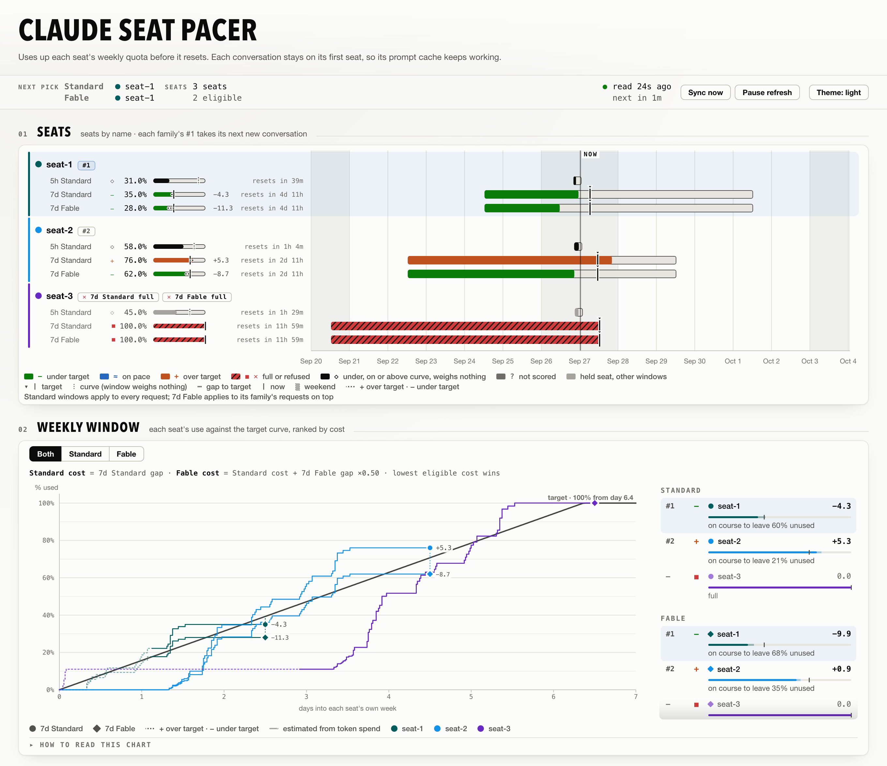

# Claude Seat Pacer

Uses up each Claude seat's weekly quota before it resets by sending every new conversation to the seat furthest behind its plan, and keeps each conversation on its seat so its prompt cache keeps working.

<picture>
  <source media="(prefers-color-scheme: dark)" srcset="docs/hero-dark.png">
  <source media="(prefers-color-scheme: light)" srcset="docs/hero-light.png">
  
</picture>

## Features

- **Paces every seat against its own week.** Each weekly window gets a plan
  that rises from nothing at the window's start to the full quota a little
  before its reset. A new conversation goes to the seat furthest behind its
  plan, so a seat still holding quota near its reset goes first, and one that
  just reset waits until the others are closer to their plans.
- **Hands new work on as each seat catches up.** The rate-limit headers on
  every completed response update that seat's reading between usage polls.
  The seat taking new conversations closes its gap as it works, and once
  another seat is further behind its own plan, new conversations start going
  there.
- **Keeps each conversation on its seat.** CLIProxyAPI's own session affinity
  never binds a conversation a plugin routes, so the plugin binds each
  conversation itself, per model; run the host with
  `routing.session-affinity: false`. A subagent on the same model shares its
  parent's seat unless that seat has refused the model. By default a
  conversation stays put through a rebalance and moves only when it has to;
  [How it picks](#how-it-picks) lists when.
- **Reads every window Anthropic reports.** The usage endpoint gives the
  5-hour window, the weekly all-models window and each model family's weekly
  window, read every two minutes by default and again a few seconds after
  each reset. The headers of every response add fresher readings of the
  5-hour, weekly and Fable weekly windows, and any refusal. A seat refused or
  full on a window takes no new conversation for the models that window caps
  while another seat has room, until a later reading shows room on it; a new
  subagent still joins its parent on a full seat, though not on a refused
  one. Conversations already on it stay by default; [How it
  picks](#how-it-picks) lists when they move.
- **Sends no probe requests.** Its only outbound request is the usage read,
  made through the host's HTTP client. Everything else comes from the
  responses your own requests already get.
- **Shows its work.** A [status page](#status-page) in the Management Center
  charts every seat against its plan, the ranking, each window's history with
  its refusals, the live bindings and the routing log. Email addresses show
  only their first letter and domain.
- **Declines rather than breaks.** The pick reads memory only, every entry
  point recovers from a panic, and the pick never answers with an error that
  would fail a request. When the plugin declines, the host's own selector
  routes the request.

## Why

A Claude subscription has a 5-hour limit and a weekly limit, and weekly quota
left at the reset is gone. More seats raise that ceiling linearly, and
[CLIProxyAPI](https://github.com/router-for-me/CLIProxyAPI) makes pooling them
easy, but its fill-first and round-robin strategies don't track how far each
seat is into its week.

I run several Claude Code sessions at once across a few seats, and I wanted
three things from the pick:

- Spend every seat's week before it resets. A seat still holding quota near
  its reset should go first, and the one that just reset should wait.
- Judge a seat by how much it has left against how long it has left. A seat
  resetting in 24 hours with 5% left is on track; one resetting in three days
  with 70% left is not, and it should take the next conversation.
- Never move a live conversation without a reason. Anthropic's prompt cache
  never crosses organizations, and about 96% of my input tokens are cache
  reads, so a moved conversation pays full price for everything it has
  already sent.

Sending everything to the seat that resets soonest looks only at the clock: it
keeps feeding a nearly spent seat while one with most of its week unused
waits. A fixed usage cutoff looks only at the meter, and wastes whatever sits
above the cutoff. A plan per weekly window weighs both. It says how much a
seat should have used by now, and the seat furthest behind its plan is the
one most at risk of reaching its reset with quota left.

The defaults suit my pool: each seat's plan reaches full quota about 15 hours
before its reset. Set `landing-target: 1.0` to plan each seat to finish at its
reset instead. For an even spread, disable the plugin and turn the host's
`routing.session-affinity` back on; its round-robin takes over.

## Install

The host must be CLIProxyAPI 7.2.145 or newer; the plugin is tested against
7.3.10 and 7.3.15.

### From the Plugin Store

1. Add the author's [registry](https://github.com/yuya-iwabuchi/cpa-plugin-registry)
   as a plugin source. In the Management Center, open Config Panel → Advanced
   → Third-party Plugin Sources, add this URL, and save (or list it under
   `store-sources` in the config below):

   ```
   https://raw.githubusercontent.com/yuya-iwabuchi/cpa-plugin-registry/main/registry.json
   ```

2. Install Claude Seat Pacer from the Plugin Store. It checks the download
   against the release's checksums and loads it without a restart.
3. Click Update when a new release shows as one, within about an hour of its
   publication.

The store records the installed version under `store:` in the plugin's config
block. The host then loads only that version and deletes the plugin's other
library files at its next start, so remove that key before installing by
hand.

### Other ways to install

Download your platform's zip from the
[latest release](https://github.com/yuya-iwabuchi/cpa-plugin-claude-seat-pacer/releases/latest)
and put the library in `~/.cli-proxy-api/plugins/<goos>/<goarch>/`, keeping its
file name. The libraries load on macOS 12, Windows 10, or Linux with glibc
2.34, or newer: on Apple silicon Macs, Windows and Linux from v0.1.1, and on
Intel Macs from v0.2.1. [SECURITY.md](SECURITY.md) shows how to verify the
zip.

Or build from source, with Go 1.25 and a C toolchain. On an Intel Mac the
build first compiles a patched Go toolchain from source, which takes a few
minutes:

```sh
git clone https://github.com/yuya-iwabuchi/cpa-plugin-claude-seat-pacer
cd cpa-plugin-claude-seat-pacer
make install   # PLUGIN_DIR overrides ~/.cli-proxy-api/plugins
```

The host loads a library the next time it applies a config change, but only
from a file path it hasn't loaded before. After replacing a loaded file,
restart the host (`brew services restart cliproxyapi` on Homebrew).

### Updating and uninstalling

A new version starts with no conversation bindings, costing each open
conversation one prompt-cache miss. On macOS, restart the host after
uninstalling: an unloaded Go library can leave a thread running in the host.

## Configure

```yaml
host: "127.0.0.1"          # optional: keeps the proxy off the network

remote-management:
  secret-key: "<a long random string>"   # the status page asks for this

routing:
  session-affinity: false

plugins:
  enabled: true
  dir: "~/.cli-proxy-api/plugins"
  store-sources:           # the author's plugin registry
    - https://raw.githubusercontent.com/yuya-iwabuchi/cpa-plugin-registry/main/registry.json
  configs:
    claude-seat-pacer:
      enabled: true
```

- CLIProxyAPI ships with plugins off. `dir` expands a leading `~/`; a relative
  path resolves against the host's working directory, which isn't your home
  directory when the host runs as a service.
- The status page reads through the management API, which the host serves only
  once `remote-management.secret-key` is set.
- Turn the host's session affinity off: the plugin owns affinity, and a
  plugin's pick never seeds the host's cache.
- Give every seat the same `priority`. The host offers the plugin only its top
  tier, so a seat alone there takes every new conversation.
- A seat is named by its credential's `note` (set on the auth-file card in the
  Management Center, or as a `note` key in the file), or else by its account
  email, masked to `y…@example.com`.

### All settings

Every key is optional; `landing-target`, `affinity.ttl`, `override-threshold`
and `poll-interval` are the ones worth tuning. The host applies changes live.
Changing `affinity.ttl` or `max-sessions` clears the bindings, costing each
open conversation one prompt-cache miss.

```yaml
      providers: [claude]       # provider keys the plugin routes; others fall to the host
      models: []                # model ids the plugin routes; empty means all
      affinity:
        enabled: true
        ttl: 1h                 # idle time before a conversation's binding expires
        subagents: true         # a subagent on the same model shares its parent conversation's seat
        override-threshold: true # keep a binding even when another seat is further behind its plan
        max-sessions: 65536     # bindings held before the least recently seen is dropped
      pace:
        shape: linear           # linear, power or sigmoid
        curve-exponent: 1.0     # power shape only, and selects it when shape is unset; above 1 holds back early
        steepness: 8.0          # sigmoid shape only
        landing-target: 1.10    # 1.10 finishes ~9% early (linear), 1.0 at the reset; 0 < x <= 4
        weekly-weight: 1.0      # weight of the all-models weekly window
        scoped-weight: 0.5      # weight of a model-family weekly window
        session-weight: 0       # weight of the 5-hour window; it is a rate limit, not a budget
        hysteresis-margin: 0.05 # cost gap a challenger must beat to move a binding when override-threshold is off
      quota:
        poll-interval: 2m       # usage-endpoint read cadence; below 30s falls back to the default
        request-timeout: 10s    # one usage read; at most 1m
        max-staleness: 15m      # a reading older than this makes the seat ineligible; at least twice poll-interval
        persist-history: true   # keep utilization history across host restarts
        usage-url: https://api.anthropic.com/api/oauth/usage
      web:
        enabled: true           # serve the status page
        history-limit: 500      # routing decisions kept for the page; 1 to 10000
```

Durations take Go syntax (`30s`, `2m`, `1h`). A weight above 100, a
`request-timeout` above 1m or a `history-limit` above 10000 runs at that bound,
and the status page says so, as it does when a `max-staleness` you set is under
twice `poll-interval` and runs at twice it. A negative weight or
`hysteresis-margin` counts as 0, and any other out-of-range value falls back to
its default. `usage-url` receives every seat's token, so it must be `https`, or
`http` to a loopback host; anything else runs at the default, with a
status-page warning. A block that doesn't parse loads the plugin disabled.

The Management Center saves each field as a top-level dotted key, such as
`affinity.ttl: 2h`, which wins over the nested form. When the two disagree the
status page names the dotted key; remove one.

## How it picks

Each weekly window's plan rises from nothing at the window's start. At the
default `landing-target: 1.10` on the linear shape it reaches the full quota
about nine-tenths of the way through the week. Any quota a seat still holds
near its reset puts it behind its plan, at 1.10 or at 1.0. How far behind a
seat is counts the all-models weekly window in full and a model-family window
at half. The 5-hour window can make a seat ineligible but carries no weight by
default: it resets several times a day and nothing in it carries over.

A seat is ineligible when:

- Anthropic has refused a request on a window covering the requested model's
  family,
- such a window reads full, or not as a number,
- no window covers the requested model's family,
- its usage read has never succeeded, or
- its reading is older than `max-staleness`.

Once bound, a conversation:

- stays on its seat while the host still offers it, and with the default
  `override-threshold` even when another seat is further behind or its own
  runs out, because the cache hit is worth more than the rebalance;
- moves when a request on its seat fails, a refusal included, and the host
  retries it on another seat, since the retry no longer offers the failed one;
- otherwise moves after a refusal for its model only when another seat can
  take that model;
- loses its binding once idle past `affinity.ttl`: the binding stops counting
  as live at once and is cleared after the next background poll.

Bindings are per model, so a conversation that switches model is placed
separately for the new one. They live in memory, so a host restart, a new
plugin version, or a change to `affinity.ttl` or `max-sessions` starts with
none.

When no seat is eligible, a conversation still gets one stable seat: first one
Anthropic has neither refused nor reported full, then the one with the fewest
live conversations. A request with no session id and no eligible seat goes to
the host's own selector. A request the host pins to one seat leaves its
conversation's binding alone.

## Status page

The Management Center gains a "Claude Seat Pacer" entry: a live dashboard of
what the plugin decides and the numbers behind it. The page calls a seat's
plan its target, and ranks the eligible seats by cost: the weighted gap to
target, negative while a seat is behind, so the lowest cost takes the next
new conversation. A seat held off ranks below them.

- **Next pick.** The bar across the top names the eligible seat the next new
  conversation lands on, for Standard requests and for each model family with
  a weekly window of its own, or that no seat is eligible, with the reason
  when the seats share one. It shows the count of eligible seats and the age
  of the newest reading, and its Sync now button reads every seat at once.
- **Seats.** Each seat's windows as bars, the weekly ones against their plan,
  with the gap to target and the time to reset, beside a two-week time axis
  showing each window's current cycle. A window holding its seat off, full or
  refused, is taped red and black, and that seat's other windows turn grey.
- **Weekly window.** Every seat's use plotted against the target curve over
  its own week, and the seats ranked by cost, each with where it is headed at
  its last 24 hours' rate.
- **5-hour window.** Where each seat stands against the limit that can make
  it ineligible.
- **Over time.** Each seat's use of one window across the recorded cycles,
  with each refusal and what ended it.
- **Bindings.** The conversations held on each seat.
- **Routing log.** The recent decisions, newest first. Each new pick and each
  move opens to show every seat's cost at that moment.

A warning banner names anything that leaves the plugin inert or degraded, such
as a seat alone on the top priority tier, a seat not read yet, or a failing
usage poll.

The page names a window by its length and the requests it gates. `5h Standard`
and `7d Standard` are the 5-hour and all-models weekly windows, which apply to
every request; `7d Fable` is a model family's weekly window, which applies to
that family's requests on top. Each family is ranked apart: `Standard` ranks
seats for models without a window of their own.

The page, at `/v0/resource/plugins/claude-seat-pacer/index.html`, carries no
data. It asks once per browser tab for the management key and reads from the
plugin's management routes, which the host answers only with that key and,
unless `remote-management.allow-remote` is on, only from the same machine.

The routes under `/v0/management/plugins/claude-seat-pacer/` are `GET status`
(the full status as JSON, `?model=<id>`), `GET page-status` (the page's view,
while `web.enabled` is on), `POST refresh`, `POST unbind?auth_id=` and
`POST bindings/sweep`.

## Privacy and data

The plugin calls one external endpoint, `usage-url`, through the host's HTTP
client with each seat's OAuth token, which the host already holds.

The status page leaves out account addresses, file paths and network addresses,
so it is safe to put on a screen. An email is masked to its first letter and
its domain, and a `note` appears as written. Credential ids are keyed by a
secret in `page-id.key` beside `history.json`; deleting that file changes every
published id. The `status` route serves everything unreduced.

`~/.cli-proxy-api/plugins/claude-seat-pacer/history.json` keeps per-seat
utilization samples across restarts: credential ids (file names or account
emails), timestamped fractions, and when the provider refused each window and
what ended each refusal. An unreadable file is set aside as
`history.json.corrupt-<unix-ts>` and a fresh one starts. No token, refresh
token or request body is ever logged, and an error that would carry a token is
scrubbed first.

## Troubleshooting

**The host does not list the plugin.** Plugins are off by default: set
`plugins.enabled: true` and point `plugins.dir` at the directory above
`<goos>/<goarch>/`. The plugin id comes from the library filename minus
its extension and `-v<version>`, and the config block, routes and history
directory all carry it, so keep the library's file name.

**An Intel Mac host crashes or logs `cliproxy_plugin_init returned 1`.**
A library older than v0.2.1 shares the host's Go runtime state on Intel Macs
and corrupts it. Update the plugin. Any other Go plugin built with stock Go
does the same, and two plugins built with the same slot patch collide with
each other, so an Intel host runs this plugin beside no other Go plugin of
either kind.

**The page keeps asking for the key.** The key is kept per browser tab. A 401
means the host did not accept the key; a 403 names its reason, either remote
management being off for a connection from another machine, or the address
being locked out for 30 minutes after five failed tries, a lock the Management
Center shares.

**The page says the management API is off (HTTP 404).** The host serves the
management API only once `remote-management.secret-key` is set. Set it,
restart the host, and enter that key on the page.

**Every new conversation lands on one seat.** That seat is alone on the top
`priority` tier. The status page warns and names the seats.

**Conversations do not stick.** The host's `routing.session-affinity` is still
on; set it to `false`. Nothing the plugin receives distinguishes the two
states, so the page cannot warn about this one.

**Seats show as ineligible.** Their reading is missing, older than
`max-staleness`, or has never succeeded. The page names the reason per seat
and carries the poll error; wait one `poll-interval` or `POST refresh`.

**The config block seems ignored.** A block that does not parse loads the
plugin disabled with defaults, and the page warns that the plugin is disabled.
Fix the YAML; the host applies the fix live, without a restart.

## Contributing

Bug reports and questions go to
[Issues](https://github.com/yuya-iwabuchi/cpa-plugin-claude-seat-pacer/issues).
Open an issue before writing code; [CONTRIBUTING.md](CONTRIBUTING.md) has the
policy, the build and the commit convention.

## Licence

MIT; see `LICENSE`. `NOTICE` carries the attribution for the CLIProxyAPI ABI
types this plugin mirrors, and `THIRD_PARTY_NOTICES` the licences of the code
the library links statically. Each release zip carries all three.
