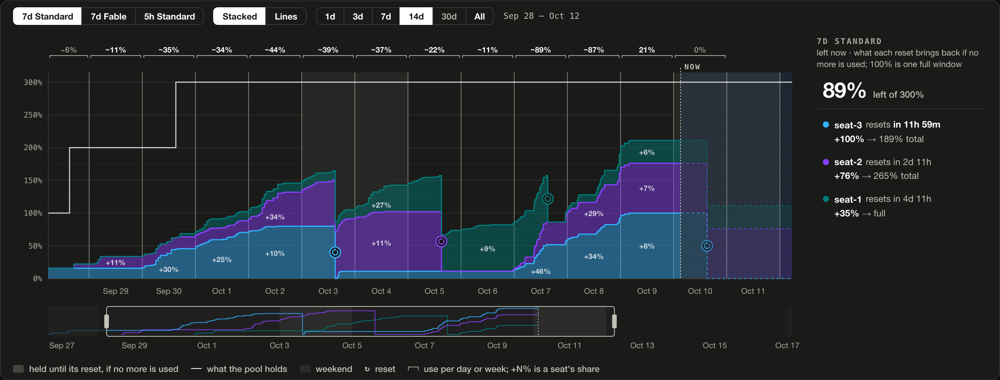
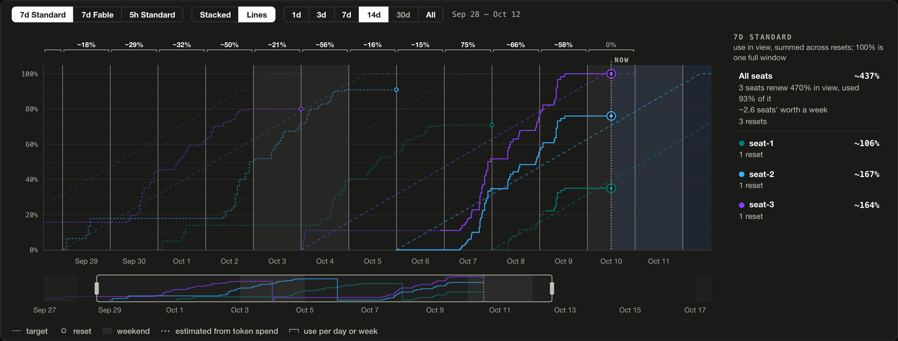

# Status page

The Management Center gains a "Claude Seat Pacer" entry: a live dashboard of
what the plugin decides and the numbers behind it. The page calls a seat's
plan its target, and ranks the eligible seats by cost: the weighted gap to
target, negative while a seat is behind, so the lowest cost takes the next
new conversation. A seat held off ranks below them.

- **Next pick.** The bar across the top names the eligible seat the next new
  conversation lands on, for Standard requests and for each model family with
  a weekly window of its own, or that no seat is eligible, with the reason
  when the seats on the tier taking requests, or every seat while no tier
  can, share one. It shows how many seats are eligible on each family's tier
  taking requests and the age of the newest reading, and its Sync now button
  reads every seat at once; the next scheduled read is then timed from it.
- **Seats.** Each seat's windows as bars, the weekly ones against their plan,
  with the gap to target and the time to reset, beside a two-week time axis
  showing each window's current cycle. A window holding its seat off, full or
  refused, is taped red and black, and that seat's other windows turn grey.
  When seats differ in `priority`, the page groups them by tier, marks the
  tier taking requests as serving, and ranks only its seats. A tier below it
  is marked fallback, and a tier whose seats are all refused, full,
  unavailable or disabled is skipped.
- **Weekly window.** Every seat's use plotted against the target curve over
  its own week, and the seats ranked by cost, each with where it is headed at
  its last 24 hours' rate.
- **5-hour window.** Where each seat stands against the limit that can make
  it ineligible.
- **Over time.** One window across the recorded cycles, counting every seat in
  the pool whatever its priority tier. Lines draws each seat's use, with each
  refusal and what ended it, and its side list totals the pool's use in seats'
  worth a week. Stacked piles the seats' use into the pool's total against
  what the pool holds, one full window per seat able to spend it, shades each
  seat's refused stretches grey, and runs past now to show what comes back at
  each reset if no more is used. Both mark the stretches in which every seat
  was refused at once. On a weekly window, brackets over the plot give the
  pool's use per local day, or per week from Monday once days are too narrow
  to label, and each bracket's tooltip sets that against what the pool renews
  and splits it by seat. If every seat is on the same plan, these figures show
  whether the pool has enough seats, though use understates demand while every
  seat is refused.

  

  

- **Bindings.** The conversations held on each seat.
- **Routing log.** The recent decisions, newest first. Each new pick and each
  move opens to show every seat's cost at that moment.

A seat you hide with the eye beside its name leaves every view, the bindings
and the routing log included, and stays hidden in that browser. A seat the host
has disabled is hidden the same way and returns once the host enables it.
`N hidden · show` under the seats draws every seat again. It shows the
disabled ones only until the page reloads, and never in Over time. Hiding
changes only the page; routing is unchanged.

A warning banner names anything that leaves the plugin inert or degraded, such
as a seat alone on the top priority tier, a seat not read yet, or a failing
usage poll.

The page names a window by its length and the requests it gates. `5h Standard`
and `7d Standard` are the 5-hour and all-models weekly windows, which apply to
every request; `7d Fable` is a model family's weekly window, which applies to
that family's requests on top. Each family is ranked apart: `Standard` ranks
seats for models without a window of their own.

The page, at `/v0/resource/plugins/claude-seat-pacer/index.html`, carries no
data. It asks once per browser tab for the management key and reads from the
plugin's management routes, which the host answers only with that key and,
unless `management.allow-remote` (`remote-management.allow-remote` before 8.0)
is on, only from the same machine.

The routes under `/v0/management/plugins/claude-seat-pacer/` are `GET status`
(the full status as JSON, `?model=<id>`), `GET page-status` (the page's view,
while `web.enabled` is on), `POST refresh`, `POST unbind?auth_id=` and
`POST bindings/sweep`.
